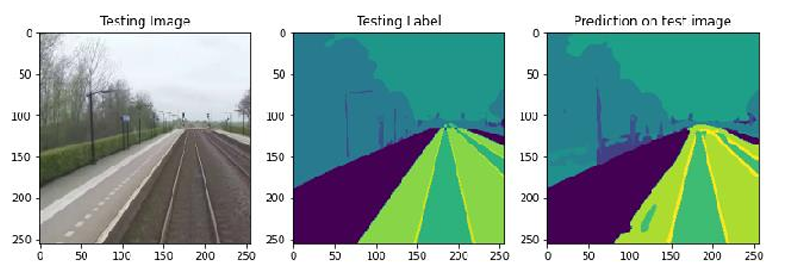

# Railway Semantic Segmentation

Semantic segmentation of railway scenes using a ResNet34-based U-Net architecture, 
trained on the RailSem19 dataset.

## Overview

This project applies deep learning to understand railway environments for autonomous 
rail vehicles. The model identifies and classifies scene elements such as rails, 
switches, signals, platforms, and obstacles at pixel level.

## Architecture

- **Encoder**: ResNet34 (pretrained on ImageNet)
- **Decoder**: U-Net with skip connections
- **Loss Function**: Focal Loss
- **Optimizer**: Adam

## Dataset

[RailSem19](https://www.wilddash.cc/railsem19) — 8,500 railway scene images from 
38 countries, 20 semantic classes.

## Results

| Metric | Value |
|--------|-------|
| Dice Score | ~70% |
| Epochs | 20 |
| Batch Size | 10 |

## Setup

```bash
pip install -r requirements.txt
```

## Tech Stack

Python · TensorFlow · Keras · OpenCV · Google Colab

## Predictions

Each image shows: **Testing Image | Testing Label | Prediction on Test Image**


